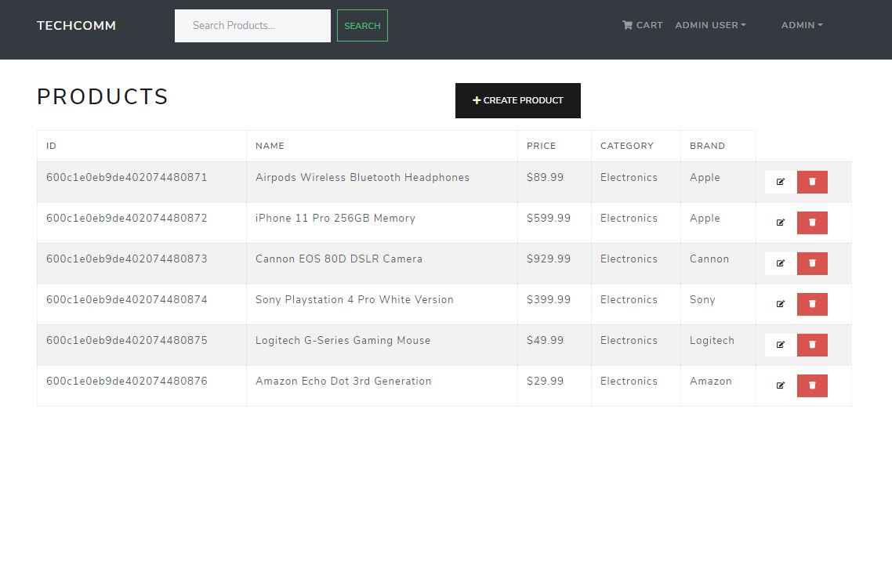

# TechComm

> Full stack e-commerce application that let's user shop their favourite products, review them, view their latest orders, and admins to manage products, users, payment and delivery.

## Deployed Application
[Click Here](https://techcomm-app.herokuapp.com/)





## Tech Stack

Frontend --> 
ReactJS, redux, react-helmet, react-bootstrap, axios, react-dom, react-redux, react-router-bootstrap, react-paypal-button-v2

Backend --> 
NodeJS, ExpressJS, MongoDB, mongoose, bcryptjs, jsonwebtoken, morgan, express-async-handler

## Install Dependencies

```
npm install
```

## Run App

```
# Run in dev mode
npm run dev

# Run in prod mode
npm start
```
